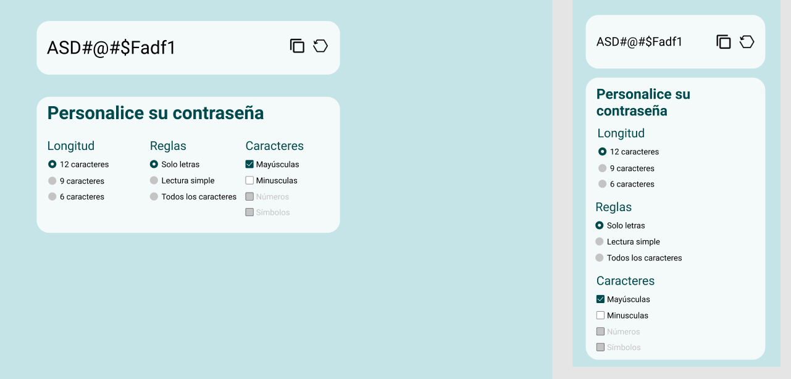

# Trabajo Practico - JS Modulo #1

## Fechas
- Pre-Entrega 26/09
- Entrega 10/10

### Pautas y requerimientos
- Ejemplo:

- Este TP tiene un desarrollo individual.
- Tecnologias:
    - Utilizar HTML, CSS y JavaScript
- Disenio:
    - La eleccion de paleta de colores y tipografia es libre.
    - Deben respetar la estructura dada por el ejemplo, en dimensiones y elementos.
    - Debe ser responsive. Se revisara mobile y tablets tanto en portrait como en landscape.
- ARQUITECTURA
    - Debe exister el index.html
    - Los estilos han de guardarse en una respectiva carpeta css
    - El js ha de guardarse en una respectiva carpeta js
    - De utilizar imagenes, deberan guardarse en una carpeta img o assets.
- GIT
    - Tendran su branch master en donde no puede haber mas commits manuales que el first commit.
    - Cada funcionalidad de su proyecto debe realizarse en una o mas branches de desarrollo, que al finalizarse haran merge de la misma a master.
    - Al revisar su proyecto, en master se revisara el historial de commits y no debe existir mas que el first commit y los merge.
    - Deben presentar el repositoriop con un README que hable del proyecto y contenga una o mas imagenes de las funcionalidades y disenio.
- HTML
    - Estructura semantica que pasa el validador de HTML (se revisara que no tengan errores)
    - Deben hacer uso de las etiquetas semanticas de HTML5 (section, article, no solamente divs)
    - Buena nomenclatura de clases.
- CSS
    - Todos los estilos han de ser manuales, sin librerias ni frameworks.
- JAVASCRIPT
    - Utiliza arrow functions
    - Utiliza let y const
    - Utiliza arrays, bucles, condicionales
    - Utiliza funciones con parametros a conciencia y las reutiliza
    - Es legible (buenas practicas y estandares)
    - Aprovecha las ventajas del sugar syntax
    - Utiliza un unico idioma (o codean en espanol o codean en ingles, no pueden mezclarse)
    - No se visualizan errores en la consola
    - No hay console.logs() codeados
    - Respeta el flow propuesto
- COMENTARIOS
    - Los comentarios han de ser usados a conciencia, no en exceso. Si algo debe ser explicado, es que hay una mejor solucion.
- FUNCIONALIDADES
    - Se generara una contrasena con caracteres aleatorios basados en lo que el usuario tilde en los checkbox y radio buttons.
    - Pueden elegir que la contrasena se vaya generando con cada click del usuario, o a partir de un button que diga "Generar" y genere esa cadena de texto basados en las opciones seleccionadas.
    - Habra un button para copiar al clipboard automaticamente.